# Tubitak1711_Rapor

## 1 - Kütüphaneler

- numpy: matematiksel operasyonlar.
- pandas: veri analizi.
- matplotlib: veri görselleştrime.
- plotly: etkileşimli veri görselleştirme.
- sklearn: makine öğrenmesi algoritmaları ve verileri ölçekleme.
- statsmodels: istatistiksel model tahmini.

## 2 - Verlerin Hazırlanması

- Anlaşmalı otellerin sağladığı verilerin 2022, 2023 ve 2024 verilerinin günlük harcanan elektrik (KWH), su (M3), doğalgaz (KWH), doluluk ve hissedilen hava sıcaklığı kısımları seçildi.
- 3 yılın verisi birleştirildi.
- 2021 ve öncesi verileri Covid dönemi nedeniyle atlandı.
- Statsmodel kütüphanesinin ilgili modülü (seasonal_decompose) kullanılarak sezonsallıktan ayırıldı.
- Veriler ayrıca hareketli ortalama yöntemi ile sezonsallıktan ayırıldı.
- Testler sonucunda 7 günlük hareketli ortalamanın en iyi sonucu verdiğine karar verildi.
- Oluşan normal sonucu otelin doluluğuna günlük olarak otel doluluğuna bölerek kişi başına düşen elektrik tüketimi elde edildi.

  

    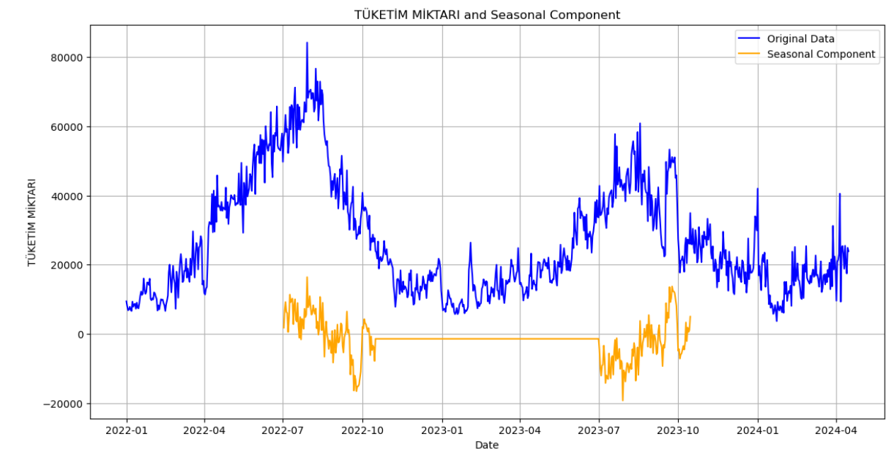
     
    <em >Statsmodel.seasonal_decompose methonunun 365 günlük penceresinin elektrik verisi üzerindeki residual sonucu</em>
  

  
  

    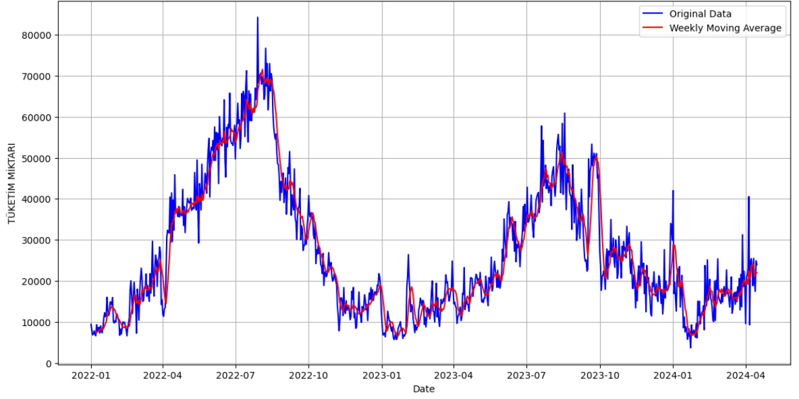
     
    <em>Elektrik verilerin 7 günlük hareketli ortalaması</em>
  

  

    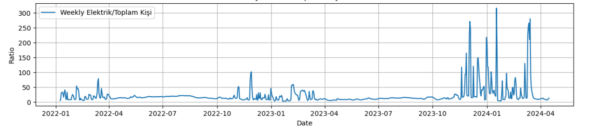
     
    <em>7 günlük hareketli ortalamanın kişi başına düşen elektrik miktarı</em>
  

  

  

    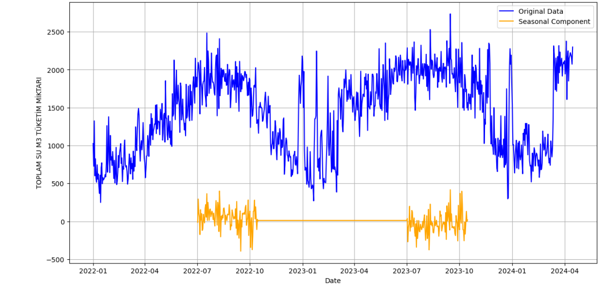
     
    <em >Statsmodel.seasonal_decompose methonunun 365 günlük penceresinin su verisi üzerindeki residual sonucu</em>
  

  

    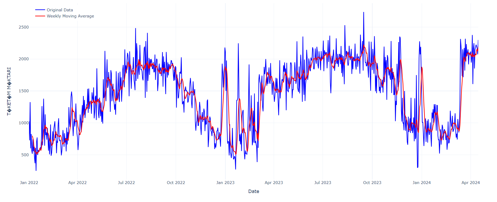
     
    <em>Su verisinin 7 günlük hareketli ortalaması</em>
  

  

    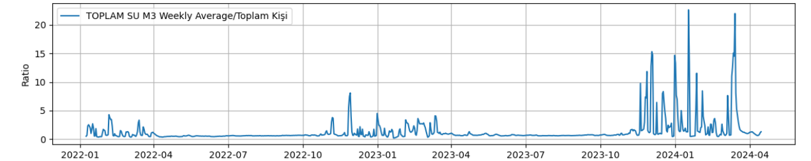
     
    <em>7 günlük hareketli ortalamanın kişi başına düşen su miktarı</em>
  

  

    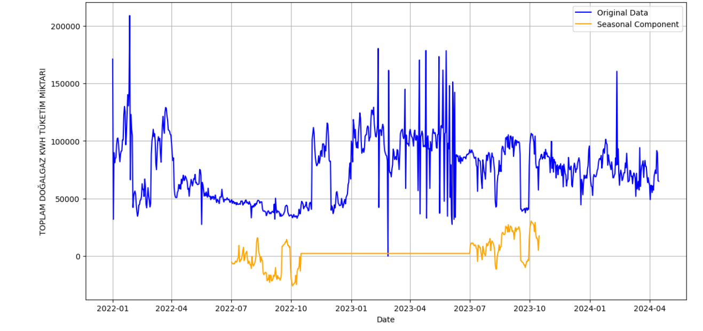
     
    <em >Statsmodel.seasonal_decompose methonunun 365 günlük penceresinin doğalgaz verisi üzerindeki residual sonucu</em>
  

  

    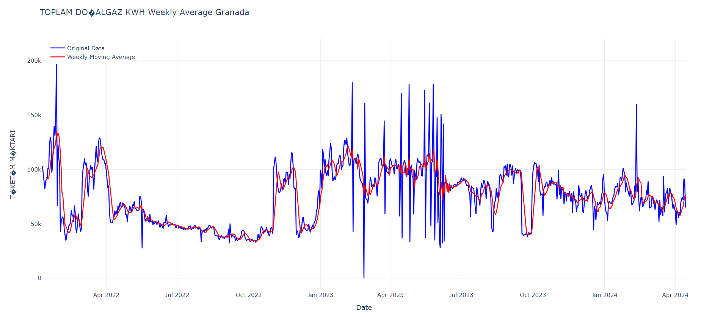
     
    <em>Doğalgaz verisinin 7 günlük hareketli ortalaması</em>
  

  

    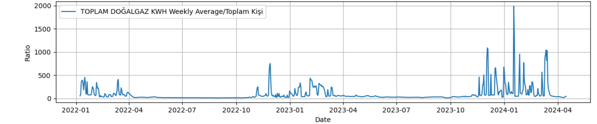
     
    <em>7 günlük hareketli ortalamanın kişi başına düşen doğalgaz miktarı</em>
  

## 3 - Anomali Tespit Yöntemleri

### 3.1 - Isolation Forest

- Isolation Forest, anomalileri normal verilerden izole ederek tespit etmeye odaklanır. Bu yöntem, anormal veri noktalarının daha az sayıda bölünme gerektirmesi nedeniyle daha kısa yollarla izole edilebileceği varsayımına dayanır.
- Büyük veri setlerinde dahi hızlı ve verimli çalışır. Bu, özellikle yüksek boyutlu ve büyük hacimli veri setleriyle çalışırken önemlidir.
- Modelin nasıl çalıştığı ve karar verme süreçleri, diğer bazı karmaşık algoritmalara kıyasla daha kolay anlaşılır ve açıklanabilir.
- Veri setindeki gürültü veya hatalı veri noktaları, Isolation Forest algoritmasının performansını önemli ölçüde etkilemez. Bu da yöntemi daha güvenilir hale getirir.

  

    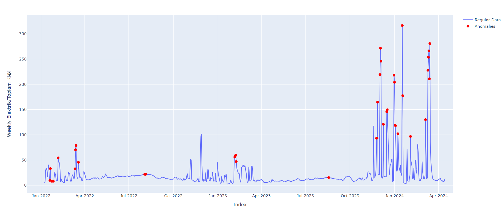
     
    <em>Elde edilen elektrik verisinin isolation forest algoritmasından geçirilmiş hali</em>
  

  

    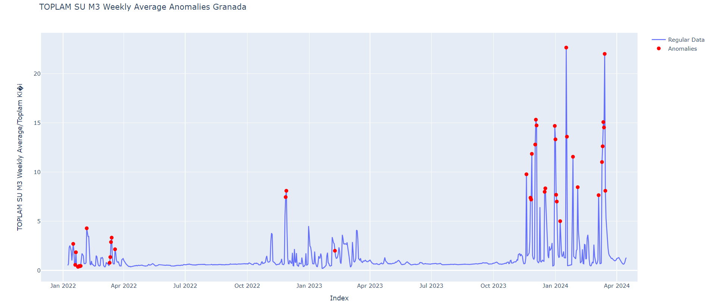
     
    <em>Elde edilen su verisinin isolation forest algoritmasından geçirilmiş hali</em>
  

  

    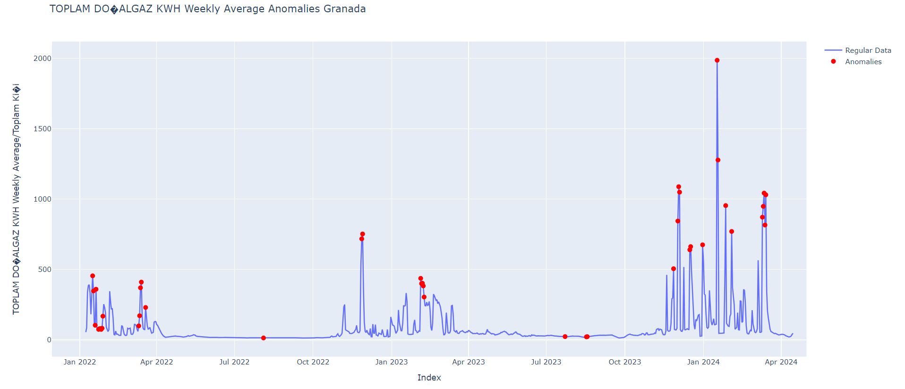
     
    <em>Elde edilen doğalgaz verisinin isolation forest algoritmasından geçirilmiş hali</em>
  

  
